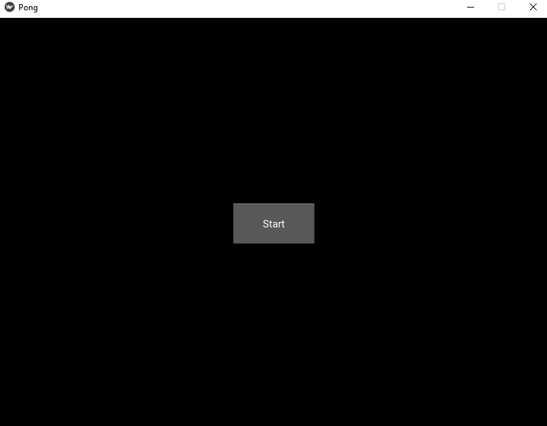
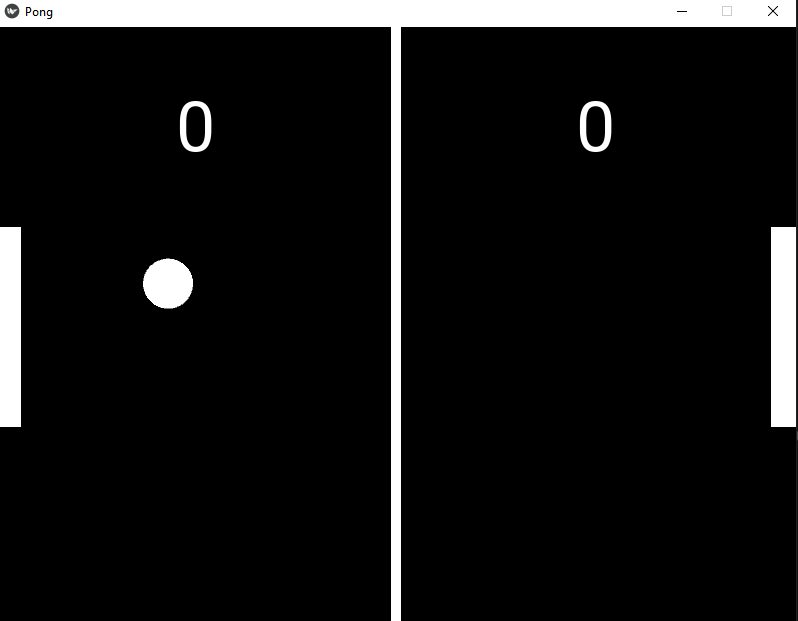
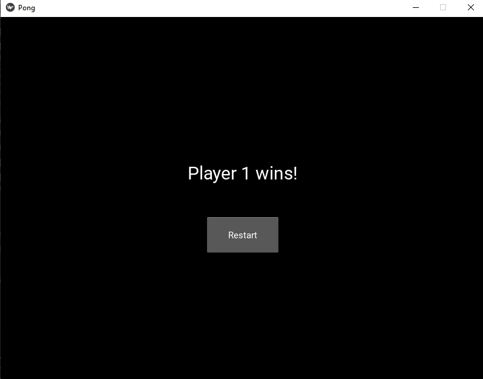

# kivy-pong

python (3.10.8)  
kivy (2.1.0)

Made just for practice on Kivy. Built on-top of the tutorial.

Added features:
* Better collision.
* Better serving (has a timer, random trajectory)
* Menu screen
* Restart screen (someone can actually win)  

To add:
* Packaging for android
* Packaging for iOS
